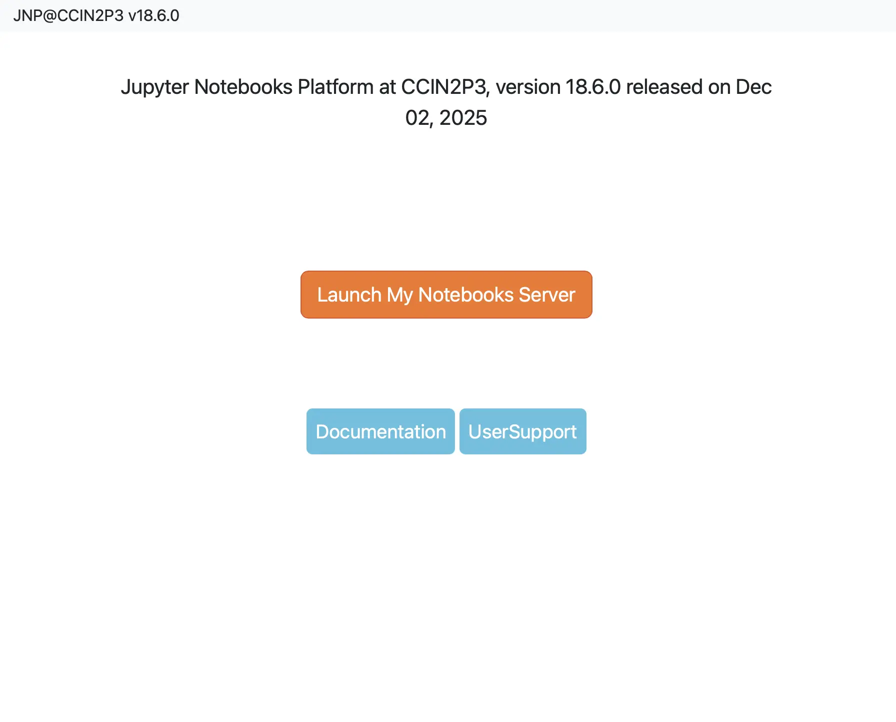
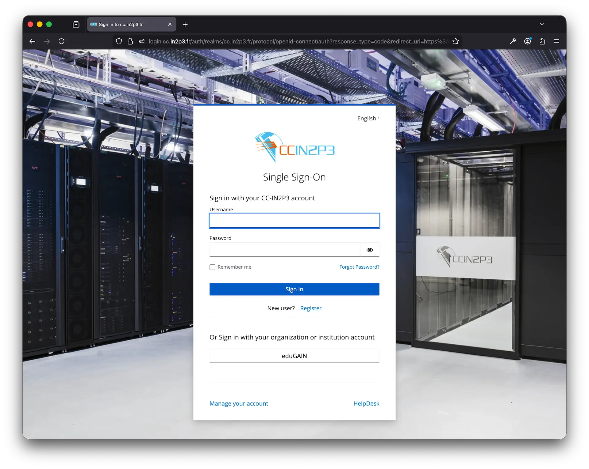
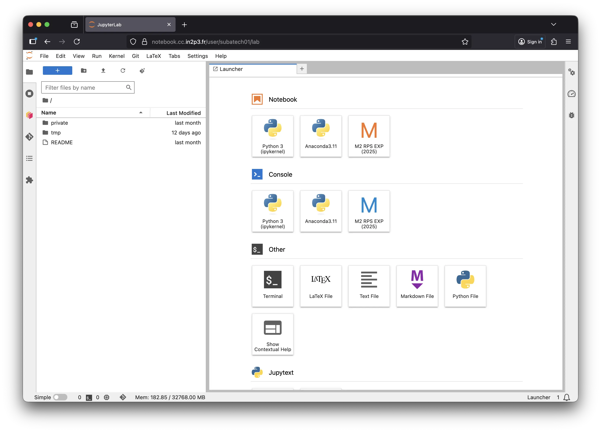
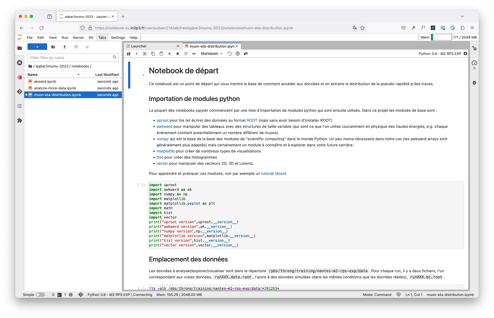
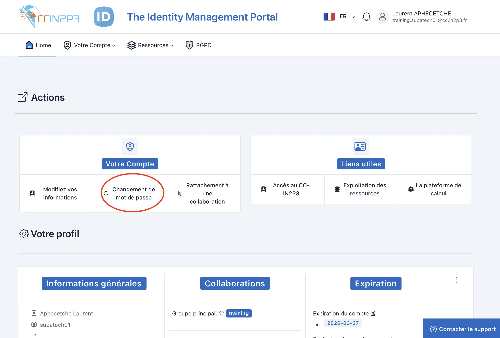

# Comment se connecter à la plateforme Jupyter du CC-IN2P3

Utilisez votre navigateur préféré pour aller sur https://notebook.cc.in2p3.fr, qui devrait ressembler à :



Cliquez sur le bouton orange "Launch My Notebooks Server". Cela devrait vous emmener vers la page d'authentification du CC-IN2P3 :



Entrez votre identifiant et votre mot de passe (donnés par vos encadrants à la première séance)

Vous obtenez alors l'écran principal de la plateforme Jupyter



# A faire après la première connexion

C'est le moment de vous [créer un compte GitHub](https://fr.wikihow.com/créer-un-compte-sur-GitHub)...

Aller dans le menu `Git -> Clone a Repository` et entrez l'adresse du dépot git qui contient le point de départ de ce projet :

```shell
https://github.com/nantes-m2-rps-exp/qqbar2mumu-2025.git
```


> Vous devrez peut-être (selon comment le dépôt aura été configuré au final) entrer vos identifiants Github : nom d'utilisateur et "personal access token" (qui est différent de votre mot de passe pour accéder à votre compte Github).

Notez qu'un répertoire `qqbar2mumu-2025` devrait apparaître dans la partie gauche de l'écran (qui est la partie "explorateur de fichiers"). A l'aide de l'explorateur de fichiers naviguez jusqu'au répertoire `qqbar2mumu-2025/notebooks` et double-cliquez sur `01-muon-eta-distribution.ipynl`. Ceci ouvre votre premier notebook qui vous sera présenté lors de la première séance.



Cliquez ensuite sur "Terminal" et exécutez la commande suivante :

```shell
mkdir -p "$HOME/.local/share/jupyter/kernels/qqbar2mumu-2025" && printf '%s\n' '{' '        "display_name": "M2 RPS EXP (2025)",' '        "language": "Python With ROOT",' '        "argv":[' '                "/pbs/throng/training/nantes-m2-rps-exp/qqbar2mumu-2025/python-helper.sh",' '                "-f",' '                "{connection_file}"' '        ]' '}' > "$HOME/.local/share/jupyter/kernels/qqbar2mumu-2025/kernel.json"

```

Déconnectez-vous (File->Log Out) et reconnectez-vous. Vous devriez maintenant voir un nouvel élément sous Notebook, vous permettant de créer un notebook avec le noyau "M2 RPS EXP (2025)", qui sera utilisé pour vos notebooks tout au long de ce projet.

Enfin, modifiez le mot de passe temporaire qui vous a été fourni pour votre accès au CC-IN2P3, en vous connectant au [portail d'identité](https://id.cc.in2p3.fr) et en cliquant sur "Changement de mot de passe".



